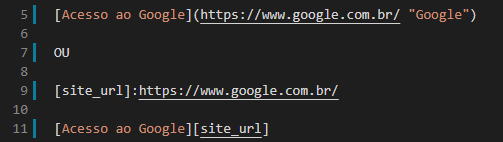

# Markdown
### Aprendendo a trabalhar com Markdown

O [site]:(https://diegoaugpedro.github.io/0002.Aprendendo_Markdown/) tem intuito de mostrar as maneiras que o Markdown pode ser utilizado para formatar seu arquivo README. Além de algumas utilizações dentro do GitHUB.

- #### Afinal, o que é o MARKDOWN?

Markdown é uma linguagem de marcação que, basicamente, faz alterações nos textos utilizando símbolos como asterisco (*), underline (_), til (~) e etc. Estilizando o texto de maneira similar ao glorioso HTML. Inclusive, é possível mesclar as duas linguagens de marcação tranquilamente.

- #### E esse tal de README, o que é?

Ele é, basicamente, um arquivo de texto que pode ser escrito a partir de tags HTML ou Markdown. O README traz informações sobre seu projeto de forma geral, ou seja, é a documentação que indica por qual motivo você criou aquele projeto, o que ele faz, quais ferramentas utilizou, o que é preciso para que utilizem e por aí vai. Como se esse  arquivo fosse o "cartão de visitas" do seu projeto.


## Os símbolos que utilizamos para estilização são:

- ##### HEADER - TÍTULOS

Para criar títulos utilizamos o símbolo "hashtag"(#). Para cada "hashtag"(#) adicionada definimos um nível para o título, que pode atingir o máximo de 6 "hashtags"(#), similar ao "h1" ao "h6" que temos no HTML. A ideia também é a mesma, organizar corretamente o conteúdo do site.

##### Exemplo:
</br>


- ##### NEGRITO

Para estilizarmos o texto com **NEGRITO** utilizamos 2 asteriscos (*) ou 2 underlines (_), no início e no fim do texto. Assim, o que estiver entre os asteriscos (*) ou underlines(_) ficará em **NEGRITO**.

##### Exemplo:
<br>


- ##### ITÁLICO

Para estilizarmos o texto com <em>ITÁLICO</em> utilizamos 1 asterisco (*) ou 1 underline (_), no início e no fim do texto. Assim, o que estiver entre o asterisco (*) ou underline (_) ficará em <em>ITÁLICO</em>.

##### Exemplo:
<br>


- ##### MISTURANDO AS COISAS

É possível utilizar a combinação de 2 underlines (_) e 1 asterisco (*) ou a combinação de 2 asteriscos (*) e 1 underline (_) para estilizar o texto com <b><em>NEGRITO</em></b> e<b><em>ITÁLICO</em></b>.
        
##### Exemplo:
<br>


- ##### RISCADO

Para estilizarmos o texto com RISCADO utilizamos 2 tils (\~), no início e no fim do texto. Assim, o
que estiver entre o til (\~) ficará RISCADO.

##### Exemplo
<br>


- ##### CITAÇÃO

Para adicionarmos uma citação utilizamos o símbolo de "maior" (>) no início da linha. Assim, o que estiver após o símbolo (>) será considerado uma citação.

##### Exemplo:
<br>


- ##### LINHAS HORIZONTAIS

Para adicionarmos Linhas Horizontais utilizamos asterisco (*), underline (_) ou hífen (-). O Markdown identifica uma linha horizontal a partir do terceiro caractere, com ou sem espaços.
        
##### Exemplo:
<br>


- ##### LISTA NÃO ORDENADA

Para criarmos listas não ordenadas utilizamos asterisco (*), adição (+) ou hífen (-) antes do item da lista. Para adicionarmos subitens a lista basta utilizar o TAB antes de cada símbolo.

##### Exemplo:
<br>


- ##### LISTA ORDENADA

Para criar uma lista ordenada basta adicionar um número e um ponto (.) qualquer antes do texto. O primeiro número que for adicionado a lista indicará onde ela começa, os números seguintes, estando em linhas consecutivas, vão continuar a sequência "automaticamente". Para adicionarmos subitens a lista basta utilizar o TAB antes de cada número.

##### Exemplo:
<br>


- ##### LINKS

Para adicionarmos um link utilizamos colchetes [] e parênteses (), onde o colchetes [] recebe a descrição do link e o parênteses recebe o endereço do link. Utilizando aspas duplas ("") é possível adicionar um texto alternativo, assim como no HTML. O texto deve ser inserido após o endereço do link. Podemos também criar um link utilizando 2 conjuntos de colchetes [], onde o primeiro recebe a descrição do link e o segundo recebe uma variável contendo o endereço do site. Essa variável precisa ser declarada previamente.

##### Exemplo:
<br>


- ##### IMAGENS

Para adicionar imagens utilizamos de sinal de exclamação (!), colchetes [] e parênteses (). Entretanto, podemos fazer isso de 4 maneiras diferentes:

- ###### Simples!
<br>

- ###### Declarando variável para imagem!
<br>

- ###### Imagem com link!
<br>

- ###### Declarando variável para imagem e link!


- ##### TABELA

Para criamos tabelas utilizamos o símbolo pipe ( | ). Com ele separaremos as colunas da tabela. As linhas são criadas após de maneira "automatica" conforme pressionamos ENTER e inserimos um novo conjunto de pipe ( | ). Para definirmos o alinhamento de cada coluna utilizamos a seguinte configuração:

* Para alinhamento a ESQUERDA utilizamos dois pontos (:) seguidos de hífen (-) |:-|
+ Para alinhamento a DIREITA utilizamos hífen (-) seguido de dois pontos (:) |-:|
- Para alinhamento a CENTRALIZADO utilizamos dois pontos (:), hífen (-) e dois pontos (:) novamente|:-:|
        
##### Exemplo:
<br>


- ##### BLOCO DE CÓDIGO

Para inserirmos um bloco de código utilizamos a crase (`). Ela transforma o texto inserido em bloco de código. Basta utilizar uma no início e no fim da linha de código. Caso precise de utilizar em mais linha, ou seja, em um bloco selecione o bloco e use o tecla TAB ou faça uso de 3 crases (```) no início e no fim do bloco, sem espaço entre elas. Lembre que não podemos misturar duas ou mais linguagens em um mesmo bloco de código. Para isso devemos criar dois blocos de códigos separados. Podemos também estilizar o bloco de código utilizando a Syntax Highlighting, adicionando o nome da linguagem apresentada no bloco logo após a 3ª crase.

##### Exemplo:
<br>


- ##### FUGINDO DA ESTILIZAÇÃO

Vimos que os símbolos são utilizados para tratar da estilização do texto, mas como faremos se quisermos mostrar exatamente o símbolo sem seu efeito de formatação? Nesse caso, temos que fazer uso da barra invertida antes do símbolo. Com isso, seu efeito de formatação é "cancelado".

##### Exemplo:
</br>


- ##### E MAIS...

Aqui no GITHUB, exato, aqui mesmo. Podemos criar checkboxes que utilizamos para montar listas de tarefas além de referências de <em>issues</em> e/ou <em>pull requests</em> utilizando apenas uma "hastag" (#) e o nome da issues / pull request. É possível mencionar usuários nos comentários utilizando o arroba (@). Dá pra utilizar até <em>emojis</em>. Também é possível utilizar todos as outras estilizações mostradas até aqui.

##### Exemplo:
<br>


Mas como vou decorar os códigos dos emojis?!?
Não se preocupe, aqui segue um site com lista de diversos emojis para utilizar: <a href="https://www.webfx.com/tools/emoji-cheat-sheet/" alt="Site com código de emojis" title="Site com códigos para emojis">EMOJIS</a>.

##### Bem, espero que esse conteúdo lhe ajude de alguma forma! Se puder, compartilhe com mais pessoas. Repasse o conhecimento! Forte abraço e LET's CODE!

##### Criado por Diego Augusto Pedro <a href="#top" alt="Para o topo" title="Para o topo"></a>